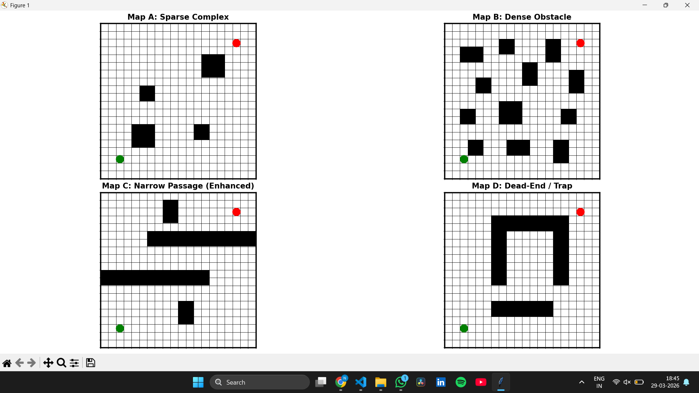
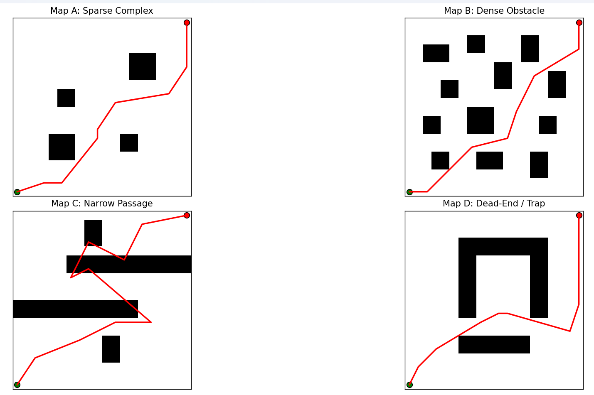
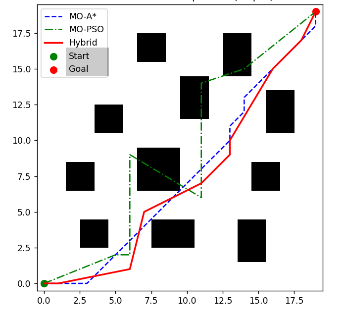

# Multi-Objective Mobile Robot Path Planning using Hybrid A*–PSO

This repository contains the implementation and experimental framework for the research project:

**“Multi-Objective Mobile Robot Path Planning Using a Hybrid A*–PSO Approach in Structured Grid Environments.”**

The project investigates hybrid deterministic–stochastic path planning techniques that combine classical graph search with swarm intelligence optimization for autonomous mobile robot navigation.

---

# Project Overview

Mobile robot navigation in structured environments often requires balancing multiple objectives such as:

* Shortest path length
* Smooth trajectory generation
* Safe obstacle clearance
* Computational efficiency

Traditional algorithms like A* guarantee feasible paths but may produce sharp turns and non-smooth trajectories. Metaheuristic optimization techniques such as Particle Swarm Optimization (PSO) provide smoother optimization but may lack deterministic stability.

This project proposes a **Hybrid A*–PSO framework** where:

* A* computes a feasible global path
* PSO refines the path to improve smoothness and safety
* Multi-objective optimization improves navigation efficiency

The repository demonstrates the implementation, visualization, experimentation, and comparison of hybrid optimization techniques for intelligent robot navigation.

---

# Features

* Hybrid A* path planning
* Particle Swarm Optimization (PSO)
* Multi-objective optimization
* Obstacle avoidance
* Optimized shortest path generation
* Grid-based robot navigation
* Path visualization using Python
* Benchmark environment testing
* Research-oriented implementation
* Experimental algorithm comparison

---

# Algorithms Implemented

## 1. Multi-Objective A*

A deterministic graph search algorithm used for generating feasible global paths in structured environments.

### Advantages

* Guaranteed feasible path generation
* Fast graph traversal
* Efficient obstacle handling
* Near-optimal path computation

---

## 2. Multi-Objective Particle Swarm Optimization (PSO)

A swarm intelligence optimization algorithm inspired by collective social behavior observed in birds and fish.

### Advantages

* Smooth trajectory optimization
* Reduced unnecessary turns
* Improved obstacle clearance
* Enhanced path quality

---

## 3. Hybrid A*–PSO Path Planning

The proposed hybrid framework combines deterministic global path planning with stochastic optimization.

### Hybrid Framework Workflow

1. A* computes the initial feasible path
2. PSO optimizes the generated trajectory
3. Multi-objective evaluation improves navigation performance

### Benefits

* Better path smoothness
* Improved safety margins
* Reduced navigation cost
* Enhanced overall efficiency

---

# Benchmark Environments

The algorithms are evaluated on four structured 20×20 grid environments:

* Sparse obstacle map
* Dense obstacle map
* Narrow passage map
* Dead-end trap map

These benchmark environments are used to evaluate the robustness and optimization capability of the proposed framework.

---

# Evaluation Metrics

The algorithms are evaluated based on:

* Path Length
* Number of Turns
* Minimum Obstacle Clearance
* Computation Time
* Success Rate

Each stochastic algorithm is evaluated across **30 independent runs** for statistical robustness.

---

# Technologies Used

* Python
* NumPy
* Matplotlib
* SciPy
* Pygame
* OpenCV

---

# Project Structure

```text
Hybrid_AStar-PSO_Robot_Navigation/
│
├── README.md
├── requirements.txt
├── main.py
├── Map_generation.py
├── Research_experiments/
├── images/
│   ├── output1.png
│   └── output2.png
└── outputs/
```

---

# Research Experiments

During the research phase, several experimental algorithms and early prototypes were developed.

These implementations are stored inside:

```text
Research_experiments/
```

These experimental codes were not included in the final evaluation results but are preserved for:

* Research transparency
* Comparative analysis
* Future improvements
* Algorithm exploration

---

# Installation

Clone the repository:

```bash
git clone https://github.com/Bhagya1416/Hybrid_AStar-PSO_Robot_Navigation.git
```

Move into the project folder:

```bash
cd Hybrid_AStar-PSO_Robot_Navigation
```

Install required dependencies:

```bash
pip install -r requirements.txt
```

---

# Requirements

```txt
numpy>=1.21.0
matplotlib>=3.5.0
pygame>=2.1.0
scipy>=1.7.0
opencv-python>=4.5.0
```

---

# How to Run

Run the main implementation file:

```bash
python main.py
```

---

# Results

## Simulation Outputs

```md

```

```md

```

```md

```

```md
## Result 1


## Result 2

```

---

# Research Paper

The complete research paper describing the methodology, benchmark environments, experiments, and comparative evaluation can be accessed below:

[View Here](https://drive.google.com/file/d/11mHyn_RpS36in5J4CN3XLKIkq5uDsJ1T/view?usp=drivesdk)

---

# Applications

* Autonomous mobile robots
* Self-driving vehicle navigation
* Warehouse automation systems
* Drone path planning
* Industrial robotics
* Intelligent navigation systems

---

# Future Work

Future extensions of this project may include:

* Dynamic obstacle environments
* Real robot integration
* Continuous-space planning
* Reinforcement learning integration
* ROS integration
* Multi-robot coordination
* 3D environment support

---

# Research Contribution

This project demonstrates how hybrid deterministic–stochastic optimization techniques can improve robotic path planning performance compared to traditional approaches.

The Hybrid A*–PSO framework helps achieve:

* Improved path optimization
* Better obstacle avoidance
* Smoother trajectories
* Reduced navigation cost
* Enhanced computational efficiency

---

# Author

## Bhagya Lakshmi Narapareddy

Aspiring AI/ML Engineer | Python Developer | Robotics Enthusiast | Designer & Video Editor

GitHub:
[https://github.com/Bhagya1416](https://github.com/Bhagya1416)

---

# License

This project is released under the MIT License.

---

# Support

If you found this project useful, consider giving this repository a ⭐ on GitHub.
